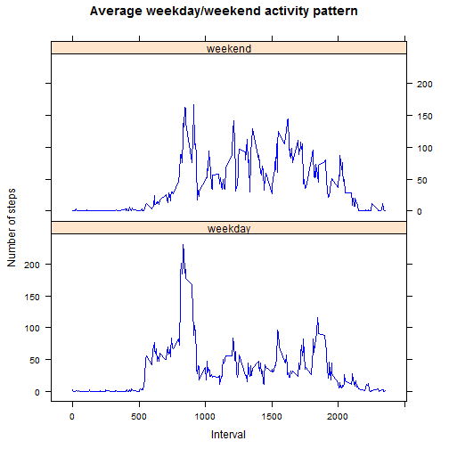

## Personal activity monitoring data analysis

It is now possible to collect a large amount of data about personal movement using activity monitoring devices such as a Fitbit, Nike Fuelband, or Jawbone Up. 

This assignment makes use of data from a personal activity monitoring device. This device collects data at 5 minute intervals through out the day. The data consists of two months of data from an anonymous individual collected during the months of October and November, 2012 and include the number of steps taken in 5 minute intervals each day.

The data for this assignment can be downloaded from the course web site:

* Dataset: [Activity monitoring data](https://d396qusza40orc.cloudfront.net/repdata%2Fdata%2Factivity.zip) [52K]

The variables included in this dataset are:

* **steps**: Number of steps taking in a 5-minute interval (missing values are coded as <span style="color:red">NA</span>)
* **date**: The date on which the measurement was taken in YYYY-MM-DD format
* **interval**: Identifier for the 5-minute interval in which measurement was taken

The dataset is stored in a comma-separated-value (CSV) file and there are a total of 17,568 observations in this dataset.


### Loading the data and additional R packages


```r
   pam_orig <- read.csv("activity.csv",header=T,sep=",")
   library("dplyr")
   library("lattice")
```

### What is the mean total number of steps taken per day?

1. Calculate the total number of steps taken per day


```r
   pam_daily <- pam_orig %>% group_by(date) %>% summarise(steps = sum(steps))
```

2. Make a histogram of the total number of steps taken each day


```r
   hist(pam_daily$steps, col="light blue",xlab = "Total steps daily", 
        main = "Number of steps per day")
```


3.  Calculate the mean of the total number of steps taken per day


```r
   mean(pam_daily$steps,na.rm = TRUE)
```

```
## [1] 10766.19
```

4.  Calculate the median of the total number of steps taken per day


```r
   median(pam_daily$steps,na.rm = TRUE)
```

```
## [1] 10765
```

### What is the average daily activity pattern?

1. Make a time series plot (i.e. <span style="color:red">type = "l"</span>) of the 5-minute interval (x-axis) and the average number of steps taken, averaged across all days (y-axis)


```r
   pam_avg <- pam_orig %>% group_by(interval) %>% summarise(steps = mean(steps,na.rm=TRUE))
   plot(pam_avg$interval,pam_avg$steps,type="l",xlab="5-minute interval",
        ylab="Average number of steps",main="Average daily activity pattern")
```


2. Which 5-minute interval, on average across all the days in the dataset, contains the maximum number of steps?


```r
   pam_avg$interval[which.max(pam_avg$steps)]
```

```
## [1] 835
```

### Imputing missing values

1. Calculate and report the total number of missing values in the dataset (i.e. the total number of rows with <span style="color:red">NA</span>s)


```r
    sum(is.na(pam_orig$steps))
```

```
## [1] 2304
```

2. Fill in all of the missing values in the dataset
(The strategy here uses the mean value of each interval to fill in the missing values for the same interval in any given day)


```r
    pam_new <- pam_orig
    names(pam_avg)[2] <- "avg_steps"
    pam_merged <- merge(pam_new,pam_avg)
    pam_merged[which(is.na(pam_merged$steps)),]$steps <- pam_merged[which(is.na(pam_merged$steps)),]$avg_steps
    pam_filled <- pam_merged[1:3]
    pam_daily2 <- pam_filled %>% group_by(date) %>% summarise(steps = sum(steps))
```
3. Make a histogram of the total number of steps taken each day


```r
    hist(pam_daily2$steps, col="light blue",xlab = "Total steps daily", 
         main = "Number of steps per day with imputed values")
```


4. Calculate and report the mean total number of steps taken per day


```r
    mean(pam_daily2$steps,na.rm = TRUE)
```

```
## [1] 10766.19
```

5. Calculate and report the median total number of steps taken per day


```r
    median(pam_daily2$steps,na.rm = TRUE)
```

```
## [1] 10766.19
```

By comparing the mean and the median values between the two datasets (with missing and filled values) we can notice that the chosen value for replacing the missing data influenced the median number of steps, but the mean value hasn't changed as no new value for the steps variable was introduced in the new dataset.

The estimates of the total daily number of steps got confirmed by imputing the missing values i.e. the high frequency values were backed up.

### Are there differences in activity patterns between weekdays and weekends?

1. Create a new factor variable in the dataset with two levels - "weekday" and "weekend" indicating whether a given date is a weekday or weekend day.


```r
    pam_filled <- pam_filled %>% mutate(day_type = ifelse(grepl("S(at|un)",weekdays(as.Date(pam_filled$date, 
                                        format = "%Y-%m-%d"))),"weekend","weekday"))
    pam_filled$day_type <- as.factor(pam_filled$day_type)
```

2. Make a panel plot containing a time series plot (i.e. type = "l") of the 5-minute interval (x-axis) and the average number of steps taken, averaged across all weekday days or weekend days (y-axis).


```r
    pam_avg2 <- pam_filled %>% group_by(interval,day_type) %>% summarise(steps = mean(steps,na.rm=TRUE))
    xyplot(steps ~ interval | day_type,
           data = pam_avg2,
           type="l",
           xlab="Interval",ylab="Number of steps",main="Average weekday/weekend activity pattern",
           col.line = "blue",
           layout=c(1,2))
```



It is evident that the activity pattern between weekends and weekdays differs. The person monitored had more active weekends than weekdays and made more steps throughout the day over the weekends.
